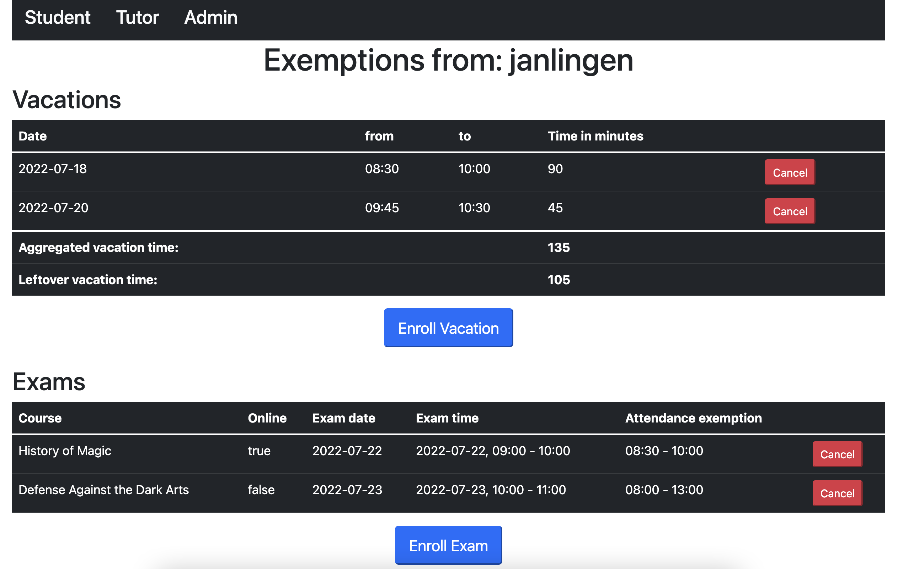
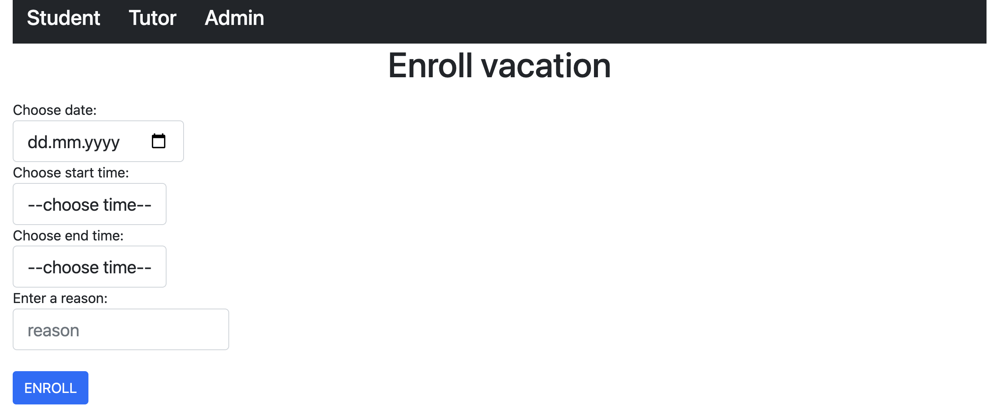
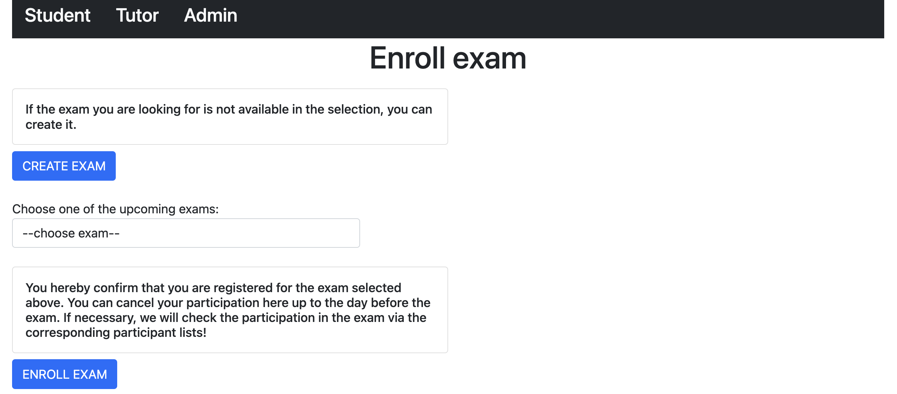
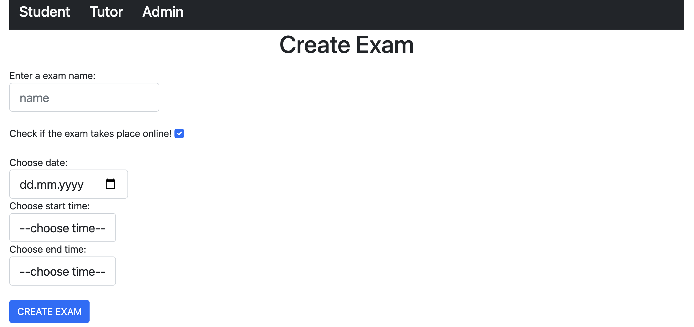
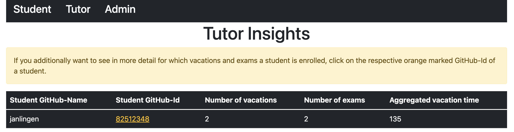
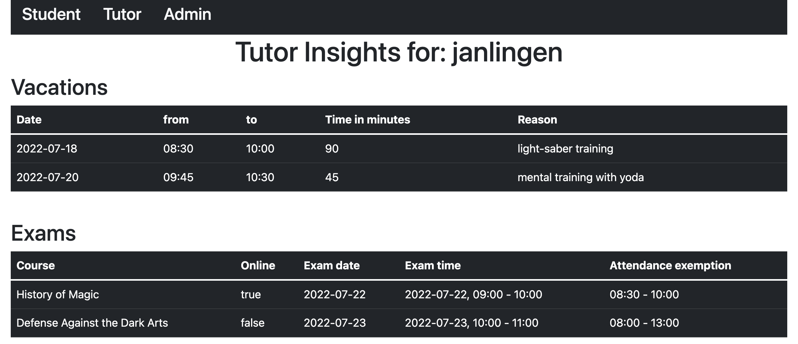
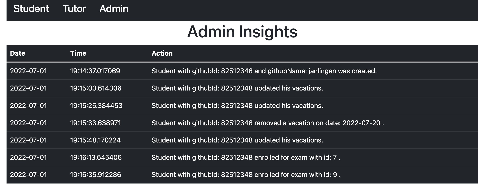

# Attendify

A spring boot application with a web user interface (thymeleaf) to manage project participant
absences in a university environment where students need to build daily attendance into their
flexible schedule, which may be filled with exams or other appointments away from home.

## Table of Contents

- [Installation and configuration](#installation-and-configuration)
- [Different stakeholder views](#different-stakeholder-views)
- [Stakeholder requirements](#stakeholder-requirements)
- [Architectural overview](#architectural-overview)
- [Quality goals](#quality-goals)
- [Vacation and Exam enrollment logic](#vacation-and-exam-enrollment-logic)

## Installation and configuration

1. Clone the repository and leave a star.
2. Make sure that you have `JDK 17.x` and `docker` installed!
3. Register a new OAuth application on
   GitHub ([tutorial here](https://docs.github.com/en/developers/apps/building-oauth-apps/creating-an-oauth-app))
   to generate a `CLIENT-ID` and `CLIENT-SECRET`
4. Set your "Personal Preferences" in the `application.properties` file which is located
   in `../src/main/resources/application.properties`
5. Start the preconfigured Docker container for the database.
   - `docker-compose up` while being in the directory
   - or `docker-compose up -d` if you want to continue using the terminal
6. Export the needed environment variables:
   - `export CLIENT_ID=YOUR_ClIENT_ID`
   - `export CLIENT_SECRET=YOUR_CLIENT_SECRET`
7. Start the application with `./gradlew bootRun` or `gradle bootRun` depending on your operating
   system.
## Different stakeholder views

### Student View

### Tutor View

### Admin View

